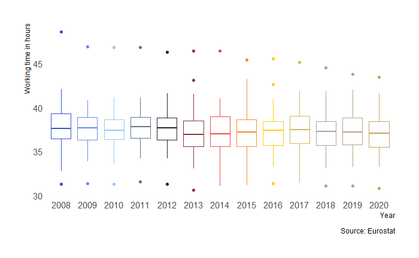

``````{r setup, include=FALSE}
knitr::opts_chunk$set(echo = TRUE, message = FALSE, warning = FALSE)

x <- c(1:10)
y <- rep(1, 10)
z <- c("a", "b", "c", "d", "e", "f", "g", "h", "i", "j")

df <- data.frame(x, y,z) 

```

# About PraxisColour

This is an R package to employ the official [Praxis Centre for Policy Studies](http://www.praxis.ee/en/) colour palette. The package was created based on [Alex Quent's MRColour](https://github.com/JAQuent/MRColour) and [Drsimonj's blog post](https://drsimonj.svbtle.com/creating-corporate-colour-palettes-for-ggplot2).

# The colour palettes

## Main

```{r palettesMain3, message=FALSE, warning=FALSE, include=TRUE}
library(PraxisColour)
library(tidyverse)
library(ggplot2)
library(hrbrthemes)

praxis_pal("main")(7)
```

```{r swatchMain, fig.width=10,fig.height=2, echo=FALSE}
df7 <- df %>%
  filter(x == 1:7)

swatch7 <- ggplot(df7, aes(x, y, fill = z))+
  geom_bar(stat="identity") +
  scale_fill_praxis(palette = "main", guide = "none") +
  theme_ipsum_rc(grid=FALSE, axis_text_size = 6)+
  theme(axis.title.x=element_blank(),
        axis.title.y=element_blank(),
        axis.text.x=element_blank(),
        axis.text.y=element_blank())+
  ylim(c(0,1))
  
swatch7
```

## Sub-palettes

### Qualitative

```{r paletteContrast}
praxis_pal("contrast")(3)
```

```{r swatchContrast, fig.width=4,fig.height=2, echo=FALSE}
df3 <- df %>%
  filter(x == 1:3)

swatch1 <- ggplot(df3, aes(x, y, fill = z))+
  geom_bar(stat="identity") +
  scale_fill_praxis(palette = "contrast", guide = "none") +
  theme_ipsum_rc(grid=FALSE, axis_text_size = 6)+
  theme(axis.title.x=element_blank(),
        axis.title.y=element_blank(),
        axis.text.x=element_blank(),
        axis.text.y=element_blank())+
  ylim(c(0,1.1))
  
swatch1
```

```{r paletteCool}
praxis_pal("cool")(3)
```

```{r swatchCool, fig.width=4,fig.height=2, echo=FALSE}
df3 <- df %>%
  filter(x == 1:3)

swatch5 <- ggplot(df3, aes(x, y, fill = z))+
  geom_bar(stat="identity") +
  scale_fill_praxis(palette = "cool", guide = "none") +
  theme_ipsum_rc(grid=FALSE, axis_text_size = 6)+
  theme(axis.title.x=element_blank(),
        axis.title.y=element_blank(),
        axis.text.x=element_blank(),
        axis.text.y=element_blank())+
  ylim(c(0,1.1))
  
swatch5
```

```{r paletteBinary}
praxis_pal("binary")(2)
```

```{r swatchBinary, fig.width=3,fig.height=1.9, echo=FALSE}
df2 <- df %>%
  filter(x == 1:2)

swatch3 <- ggplot(df2, aes(x, y, fill = z))+
  geom_bar(stat="identity") +
  scale_fill_praxis(palette = "binary", guide = "none") +
  theme_ipsum_rc(grid=FALSE, axis_text_size = 6)+
  theme(axis.title.x=element_blank(),
        axis.title.y=element_blank(),
        axis.text.x=element_blank(),
        axis.text.y=element_blank())+
  ylim(c(0,1))
  
swatch3
```

```{r paletteBlackGold}
praxis_pal("blackgold")(2)
```

```{r swatchBG, fig.width=3,fig.height=1.9, echo=FALSE}
swatch4 <- ggplot(df2, aes(x, y, fill = z))+
  geom_bar(stat="identity") +
  scale_fill_praxis(palette = "blackgold", guide = "none") +
  theme_ipsum_rc(grid=FALSE, axis_text_size = 6)+
  theme(axis.title.x=element_blank(),
        axis.title.y=element_blank(),
        axis.text.x=element_blank(),
        axis.text.y=element_blank())+
  ylim(c(0,1))
  
swatch4
```


```{r paletteMonochrome}
praxis_pal("monochrome")(2)
```

```{r swatchMono, fig.width=3,fig.height=1.9, echo=FALSE}
swatch6 <- ggplot(df2, aes(x, y, fill = z))+
  geom_bar(stat="identity") +
  scale_fill_praxis(palette = "monochrome", guide = "none") +
  theme_ipsum_rc(grid=FALSE, axis_text_size = 6)+
  theme(axis.title.x=element_blank(),
        axis.title.y=element_blank(),
        axis.text.x=element_blank(),
        axis.text.y=element_blank())+
  ylim(c(0,1))
  
swatch6
```

Each palette has a gradient. For example:

```{r palettesMain10, message=FALSE, warning=FALSE, include=TRUE}
praxis_pal("contrast")(10)
```

```{r swatchMain10, fig.width=10,fig.height=2, echo=FALSE}

swatch2 <- ggplot(df, aes(x, y, fill = z))+
  geom_bar(stat="identity") +
  scale_fill_praxis(palette = "contrast", guide = "none") +
  theme_ipsum_rc(grid=FALSE, axis_text_size = 6)+
  theme(axis.title.x=element_blank(),
        axis.title.y=element_blank(),
        axis.text.x=element_blank(),
        axis.text.y=element_blank())+
  ylim(c(0,1.4))
  
swatch2
```


### Sequential palettes


```{r paletteSeqB}
praxis_pal("seq_blue")(7)
```

```{r swatchSeqBlu, fig.width=10,fig.height=2, echo=FALSE}
swatch9 <- ggplot(df7, aes(x, y, fill = z))+
  geom_bar(stat="identity") +
  scale_fill_praxis(palette = "seq_blue", guide = "none") +
  theme_ipsum_rc(grid=FALSE, axis_text_size = 6)+
  theme(axis.title.x=element_blank(),
        axis.title.y=element_blank(),
        axis.text.x=element_blank(),
        axis.text.y=element_blank())+
  ylim(c(0,1))
  
swatch9
```


```{r paletteSeqY}
praxis_pal("seq_yellow")(7)
```

```{r swatchSeqlYellow, fig.width=10,fig.height=2, echo=FALSE}
swatch16 <- ggplot(df7, aes(x, y, fill = z))+
  geom_bar(stat="identity") +
  scale_fill_praxis(palette = "seq_yellow", guide = "none") +
  theme_ipsum_rc(grid=FALSE, axis_text_size = 6)+
  theme(axis.title.x=element_blank(),
        axis.title.y=element_blank(),
        axis.text.x=element_blank(),
        axis.text.y=element_blank())+
  ylim(c(0,1))
  
swatch16
```

```{r paletteSeqR}
praxis_pal("seq_red")(7)
```

```{r swatchSeqR, fig.width=10,fig.height=2, echo=FALSE}
swatch10 <- ggplot(df7, aes(x, y, fill = z))+
  geom_bar(stat="identity") +
  scale_fill_praxis(palette = "seq_red", guide = "none") +
  theme_ipsum_rc(grid=FALSE, axis_text_size = 6)+
  theme(axis.title.x=element_blank(),
        axis.title.y=element_blank(),
        axis.text.x=element_blank(),
        axis.text.y=element_blank())+
  ylim(c(0,1))
  
swatch10
```

```{r paletteSeqg}
praxis_pal("seq_gold")(7)
```

```{r swatchSeqlG, fig.width=10,fig.height=2, echo=FALSE}
swatch16 <- ggplot(df7, aes(x, y, fill = z))+
  geom_bar(stat="identity") +
  scale_fill_praxis(palette = "seq_gold", guide = "none") +
  theme_ipsum_rc(grid=FALSE, axis_text_size = 6)+
  theme(axis.title.x=element_blank(),
        axis.title.y=element_blank(),
        axis.text.x=element_blank(),
        axis.text.y=element_blank())+
  ylim(c(0,1))
  
swatch16
```

```{r paletteSeqBla}
praxis_pal("seq_black")(7)
```

```{r swatchSeqBla, fig.width=10,fig.height=2, echo=FALSE}
swatch11 <- ggplot(df7, aes(x, y, fill = z))+
  geom_bar(stat="identity") +
  scale_fill_praxis(palette = "seq_black", guide = "none") +
  theme_ipsum_rc(grid=FALSE, axis_text_size = 6)+
  theme(axis.title.x=element_blank(),
        axis.title.y=element_blank(),
        axis.text.x=element_blank(),
        axis.text.y=element_blank())+
  ylim(c(0,1))
  
swatch11
```

### Diverging palettes


```{r paletteDivbr}
praxis_pal("diverging_br")(7)
```

```{r swatchDivbr, fig.width=10,fig.height=2, echo=FALSE}
swatch8 <- ggplot(df7, aes(x, y, fill = z))+
  geom_bar(stat="identity") +
  scale_fill_praxis(palette = "diverging_br", guide = "none") +
  theme_ipsum_rc(grid=FALSE, axis_text_size = 6)+
  theme(axis.title.x=element_blank(),
        axis.title.y=element_blank(),
        axis.text.x=element_blank(),
        axis.text.y=element_blank())+
  ylim(c(0,1))
  
swatch8
```
```{r paletteDivbg}
praxis_pal("diverging_bg")(7)
```


```{r swatchDiv_bg, fig.width=10,fig.height=2, echo=FALSE}
swatch12 <- ggplot(df7, aes(x, y, fill = z))+
  geom_bar(stat="identity") +
  scale_fill_praxis(palette = "diverging_bg", guide = "none") +
  theme_ipsum_rc(grid=FALSE, axis_text_size = 6)+
  theme(axis.title.x=element_blank(),
        axis.title.y=element_blank(),
        axis.text.x=element_blank(),
        axis.text.y=element_blank())+
  ylim(c(0,1))
  
swatch12
```

```{r paletteDivby}
praxis_pal("diverging_by")(7)
```


```{r swatchDiv_by, fig.width=10,fig.height=2, echo=FALSE}
swatch12 <- ggplot(df7, aes(x, y, fill = z))+
  geom_bar(stat="identity") +
  scale_fill_praxis(palette = "diverging_by", guide = "none") +
  theme_ipsum_rc(grid=FALSE, axis_text_size = 6)+
  theme(axis.title.x=element_blank(),
        axis.title.y=element_blank(),
        axis.text.x=element_blank(),
        axis.text.y=element_blank())+
  ylim(c(0,1))
  
swatch12
```


## `ggplot` examples

You can specify a colour from the following: `praxis_cols("blue", "lightblue", "black", "red", "yellow", "grey", "gold")`

```{r dotsSin, warning=FALSE}
ggplot(mtcars, aes(hp, mpg)) +
    geom_point(colour = praxis_cols("blue"),
               size = 8, alpha = .8) +
    import_roboto_condensed()+
    theme_ipsum_rc(grid=FALSE)
```

```{r dotsall, warning=FALSE}
ggplot(mpg, aes(displ, hwy, colour = class)) +
  geom_point(size = 2) +
  scale_colour_praxis(palette = "main")  +
    theme_ipsum_rc(grid=FALSE)
```

``` {r barAll, warning=FALSE}
ggplot(mpg, aes(manufacturer, fill = manufacturer)) +
  geom_bar()+
  scale_fill_praxis(palette = "main", guide = "none") +
  theme_ipsum_rc(grid=FALSE, axis_text_size = 6)
```


``` {r barAllseq, warning=FALSE}
ggplot(mpg, aes(manufacturer, fill = manufacturer)) +
  geom_bar()+
  scale_fill_praxis(palette = "seq_blue", guide = "none") +
  theme_ipsum_rc(grid=FALSE, axis_text_size = 6)
```


``` {r barAlldiv, warning=FALSE}
ggplot(mpg, aes(manufacturer, fill = manufacturer)) +
  geom_bar()+
  scale_fill_praxis(palette = "diverging_br", guide = "none") +
  theme_ipsum_rc(grid=FALSE, axis_text_size = 6)
```

A boxplot example contributed by Märt Masso.

```{r boxplot, echo=FALSE, fig.align='left', fig.cap=, message=FALSE, warning=FALSE, out.width="90%",fig.cap = ""}



```

```{r dotsCon, warning=FALSE}
ggplot(iris, aes(Sepal.Width, Sepal.Length, colour = Species)) +
  geom_point(size = 2) +
  scale_colour_praxis(palette = "contrast")  +
    theme_ipsum_rc(grid=FALSE)
```


```{r dots2, warning=FALSE}
ggplot(iris, aes(Sepal.Width, Sepal.Length, colour = Species)) +
  geom_point(size = 2) +
  scale_colour_praxis(palette = "cool")  +
    theme_ipsum_rc(grid=FALSE)
```


```{r dotsBin, warning=FALSE}

iris.sub <- iris %>%
  filter(Species != "versicolour")

ggplot(iris.sub, aes(Sepal.Width, Sepal.Length, colour = Species)) +
  geom_point(size = 2) +
  scale_colour_praxis(palette = "binary")  +
    theme_ipsum_rc(grid=FALSE)
```


```{r dotsBG, warning=FALSE}

iris.sub <- iris %>%
  filter(Species != "versicolour")

ggplot(iris.sub, aes(Sepal.Width, Sepal.Length, colour = Species)) +
  geom_point(size = 2) +
  scale_colour_praxis(palette = "blackgold")  +
    theme_ipsum_rc(grid=FALSE)
```

```{r dotsMono, warning=FALSE}

iris.sub <- iris %>%
  filter(Species != "versicolour")

ggplot(iris.sub, aes(Sepal.Width, Sepal.Length, colour = Species)) +
  geom_point(size = 2) +
  scale_colour_praxis(palette = "monochrome")  +
    theme_ipsum_rc(grid=FALSE)
```

# Installing the package

Start by installing the devtool's package

```{r devtoolsInstall, eval=FALSE, message=FALSE, warning=FALSE, include=TRUE}
install.packages("devtools")
```

Then download this package from github
```{r GithubDL, eval=FALSE, message=FALSE, warning=FALSE, include=TRUE}
library(devtools)
install_github("mvainre/PraxisColour")
```
Now you're ready to use it:
```{r Run, message=FALSE, warning=FALSE, eval=FALSE,  include=TRUE}
library(PraxisColour)
```
