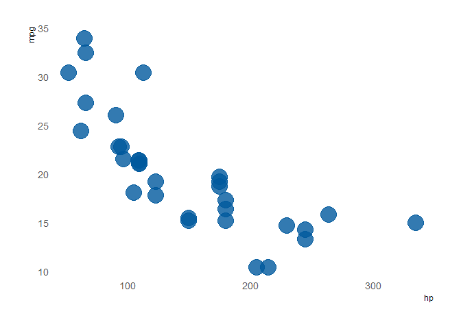
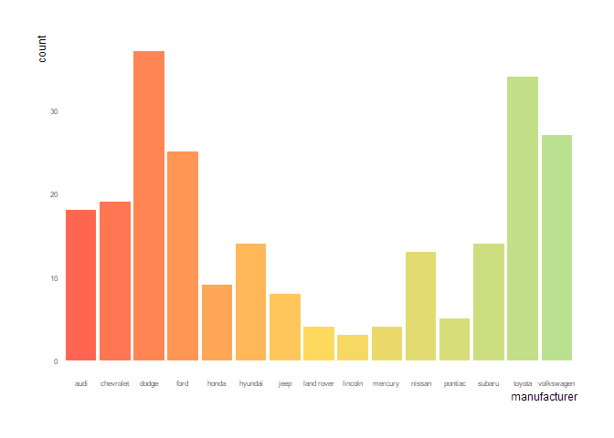

PraxisColour Readme
================
Maris Vainre
19/02/2020

# About PraxisColour

This is a R package to employ the unofficial [Praxis Centre for Policy
Studies](http://www.praxis.ee/en/) colour palette. The package was
created based on [Alex Quent’s
MRColour](https://github.com/JAQuent/MRColour) and [Drsimonj’s blog
post](https://drsimonj.svbtle.com/creating-corporate-colour-palettes-for-ggplot2).

# The colour palettes

``` r
praxis_pal("main")(3)
```

    ## [1] "#00599D" "#FF6651" "#84DAD3"

``` r
praxis_pal("main")(10)
```

    ##  [1] "#00599D" "#385B8C" "#715E7B" "#AA616A" "#E26459" "#F1725F" "#D68C7C"
    ##  [8] "#BAA699" "#9FC0B6" "#84DAD3"

``` r
praxis_pal("binary")(2)
```

    ## [1] "#00599D" "#F2F2F2"

``` r
praxis_pal("cool")(3)
```

    ## [1] "#00599D" "#84DAD3" "#8CD9FC"

``` r
praxis_pal("traffic")(3)
```

    ## [1] "#FF6651" "#FFD85D" "#BAE18F"

``` r
praxis_pal("full")(7)
```

    ## [1] "#00599D" "#FF6651" "#84DAD3" "#FFD85D" "#8CD9FC" "#BAE18F" "#F2F2F2"

## Ggplot examples

``` r
ggplot(mtcars, aes(hp, mpg)) +
    geom_point(color = praxis_cols("blue"),
               size = 8, alpha = .8) +
    theme_ipsum_tw(grid=FALSE)
```

<!-- -->

``` r
ggplot(iris, aes(Sepal.Width, Sepal.Length, color = Species)) +
  geom_point(size = 2) +
  scale_color_praxis()  +
    theme_ipsum_tw(grid=FALSE)
```

<!-- -->

``` r
ggplot(mpg, aes(manufacturer, fill = manufacturer)) +
  geom_bar() +
  scale_fill_praxis(palette = "traffic", guide = "none") +
  theme_ipsum_tw(grid=FALSE, axis_text_size = 6)
```

<!-- -->

# Installing the package

Start by installing the devtool’s package

Then download this package from github

``` r
library(devtools)
install_github("mvainre/PraxisColour")
```

Now you’re ready to use it:

``` r
library(PraxisColour)
```
