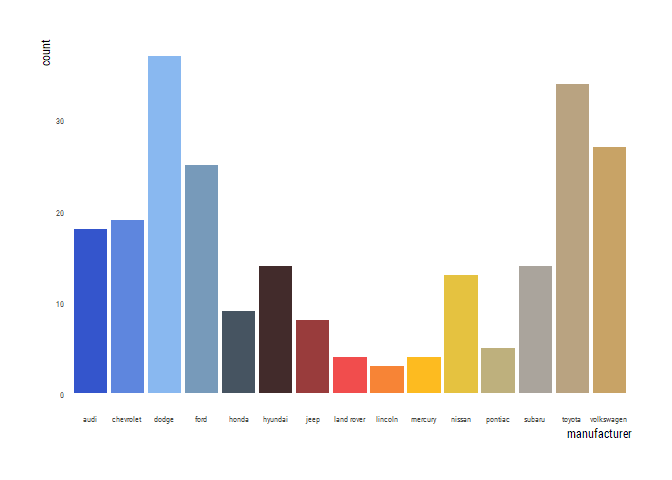
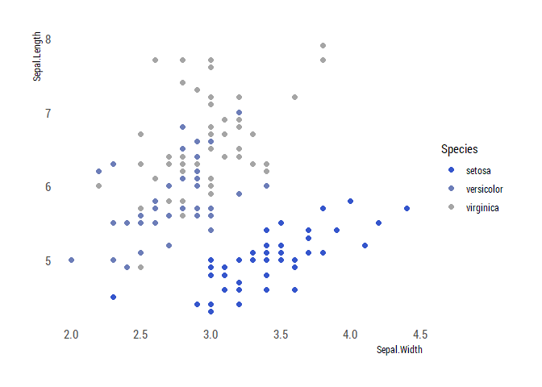

Readme
================
Maris Vainre
01/04/2021

# About PraxisColour

This is an R package to employ the official [Praxis Centre for Policy
Studies](http://www.praxis.ee/en/) colour palette. The package was
created based on [Alex Quent’s
MRColour](https://github.com/JAQuent/MRColour) and [Drsimonj’s blog
post](https://drsimonj.svbtle.com/creating-corporate-colour-palettes-for-ggplot2).

# The colour palettes

``` r
library(PraxisColour)
library(tidyverse)
library(ggplot2)
library(hrbrthemes)

praxis_pal("main")(7)
```

    ## [1] "#3455CC" "#98C9F6" "#262626" "#F14D4D" "#FFCE19" "#A5A5A5" "#C8A366"

<!-- -->

## Sub-palettes

``` r
praxis_pal("contrast")(3)
```

    ## [1] "#3455CC" "#F14D4D" "#FFCE19"

<!-- -->

``` r
praxis_pal("cool")(3)
```

    ## [1] "#3455CC" "#A5A5A5" "#98C9F6"

<!-- -->

``` r
praxis_pal("binary")(2)
```

    ## [1] "#3455CC" "#A5A5A5"

<!-- -->

``` r
praxis_pal("blackgold")(2)
```

    ## [1] "#262626" "#C8A366"

<!-- -->

``` r
praxis_pal("monochrome")(2)
```

    ## [1] "#262626" "#A5A5A5"

<!-- -->

Each palette has a gradient. For example:

``` r
praxis_pal("contrast")(10)
```

    ##  [1] "#3455CC" "#5E53AF" "#885193" "#B24F77" "#DC4D5B" "#F25B47" "#F5773B"
    ##  [8] "#F89430" "#FBB124" "#FFCE19"

<!-- -->

## `ggplot` examples

You can specify a colour from the following:
`praxis_cols("blue", "lightblue", "black", "red", "yellow", "grey", "gold")`

``` r
ggplot(mtcars, aes(hp, mpg)) +
    geom_point(color = praxis_cols("blue"),
               size = 8, alpha = .8) +
    import_roboto_condensed()+
    theme_ipsum_rc(grid=FALSE)
```

<!-- -->

``` r
ggplot(mpg, aes(displ, hwy, color = class)) +
  geom_point(size = 2) +
  scale_color_praxis(palette = "main")  +
    theme_ipsum_rc(grid=FALSE)
```

<!-- -->

``` r
ggplot(mpg, aes(manufacturer, fill = manufacturer)) +
  geom_bar()+
  scale_fill_praxis(palette = "main", guide = "none") +
  theme_ipsum_rc(grid=FALSE, axis_text_size = 6)
```

<!-- -->

``` r
ggplot(iris, aes(Sepal.Width, Sepal.Length, color = Species)) +
  geom_point(size = 2) +
  scale_color_praxis(palette = "contrast")  +
    theme_ipsum_rc(grid=FALSE)
```

<!-- -->

``` r
ggplot(iris, aes(Sepal.Width, Sepal.Length, color = Species)) +
  geom_point(size = 2) +
  scale_color_praxis(palette = "cool")  +
    theme_ipsum_rc(grid=FALSE)
```

<!-- -->

``` r
iris.sub <- iris %>%
  filter(Species != "versicolor")

ggplot(iris.sub, aes(Sepal.Width, Sepal.Length, color = Species)) +
  geom_point(size = 2) +
  scale_color_praxis(palette = "binary")  +
    theme_ipsum_rc(grid=FALSE)
```

<!-- -->

``` r
iris.sub <- iris %>%
  filter(Species != "versicolor")

ggplot(iris.sub, aes(Sepal.Width, Sepal.Length, color = Species)) +
  geom_point(size = 2) +
  scale_color_praxis(palette = "blackgold")  +
    theme_ipsum_rc(grid=FALSE)
```

<!-- -->

``` r
iris.sub <- iris %>%
  filter(Species != "versicolor")

ggplot(iris.sub, aes(Sepal.Width, Sepal.Length, color = Species)) +
  geom_point(size = 2) +
  scale_color_praxis(palette = "monochrome")  +
    theme_ipsum_rc(grid=FALSE)
```

<!-- -->

# Installing the package

Start by installing the devtool’s package

``` r
install.packages("devtools")
```

Then download this package from github

``` r
library(devtools)
install_github("mvainre/PraxisColour")
```

Now you’re ready to use it:

``` r
library(PraxisColour)
```
