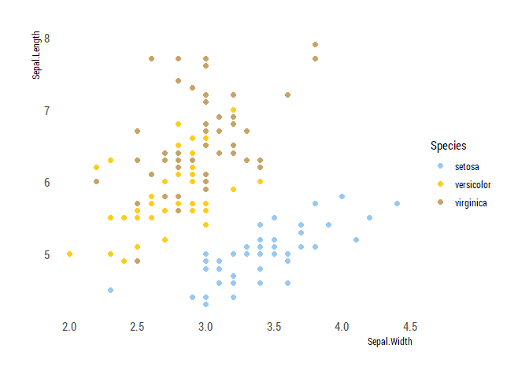
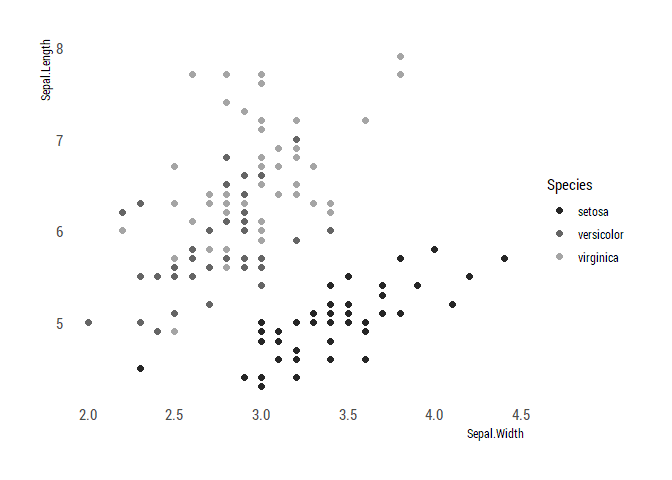

Readme
================
Maris Vainre
08/06/2020

# About PraxisColour

This is a R package to employ the unofficial [Praxis Centre for Policy
Studies](http://www.praxis.ee/en/) colour palette. The package was
created based on [Alex Quent’s
MRColour](https://github.com/JAQuent/MRColour) and [Drsimonj’s blog
post](https://drsimonj.svbtle.com/creating-corporate-colour-palettes-for-ggplot2).

# The colour palettes

``` r
library(ggplot2)
library(hrbrthemes)
library(PraxisColour)
library(tidyverse)

praxis_pal("main")(3)
```

    ## [1] "#B2D2EC" "#3F6ECD" "#F14D4D"

``` r
praxis_pal("main")(10)
```

    ##  [1] "#B2D2EC" "#98BBE5" "#7EA5DE" "#658FD7" "#4B79D0" "#526ABE" "#7A63A2"
    ##  [8] "#A15B85" "#C95469" "#F14D4D"

``` r
praxis_pal("binary")(2)
```

    ## [1] "#3F6ECD" "#A5A5A5"

``` r
praxis_pal("cool")(3)
```

    ## [1] "#B2D2EC" "#3F6ECD" "#A5A5A5"

``` r
praxis_pal("monochrome")(3)
```

    ## [1] "#000000" "#525252" "#A5A5A5"

``` r
praxis_pal("full")(7)
```

    ## [1] "#B2D2EC" "#527ED2" "#B55877" "#782626" "#363636" "#AAA49A" "#C8A366"

## Ggplot examples

``` r
ggplot(mtcars, aes(hp, mpg)) +
    geom_point(color = praxis_cols("blue"),
               size = 8, alpha = .8) +
    import_roboto_condensed()+
    theme_ipsum_rc(grid=FALSE)
```

<!-- -->

``` r
ggplot(iris, aes(Sepal.Width, Sepal.Length, color = Species)) +
  geom_point(size = 2) +
  scale_color_praxis()  +
    theme_ipsum_rc(grid=FALSE)
```

<!-- -->

``` r
iris.sub <- iris %>%
  filter(Species != "versicolor")

ggplot(iris.sub, aes(Sepal.Width, Sepal.Length, color = Species)) +
  geom_point(size = 2) +
  scale_color_praxis(palette = "binary")  +
    theme_ipsum_rc(grid=FALSE)
```

<!-- -->

``` r
iris.sub <- iris %>%
  filter(Species != "versicolor")

ggplot(iris.sub, aes(Sepal.Width, Sepal.Length, color = Species)) +
  geom_point(size = 2) +
  scale_color_praxis(palette = "monochrome")  +
    theme_ipsum_rc(grid=FALSE)
```

<!-- -->

``` r
ggplot(iris, aes(Sepal.Width, Sepal.Length, color = Species)) +
  geom_point(size = 2) +
  scale_color_praxis(palette = "cool")  +
    theme_ipsum_rc(grid=FALSE)
```

<!-- -->

``` r
ggplot(mpg, aes(manufacturer, fill = manufacturer)) +
  geom_bar()+
  scale_fill_praxis(palette = "full", guide = "none") +
  theme_ipsum_rc(grid=FALSE, axis_text_size = 6)
```

<!-- -->

# Installing the package

Start by installing the devtool’s package

``` r
install.packages("devtools")
```

Then download this package from github

``` r
library(devtools)
install_github("mvainre/PraxisColour")
```

Now you’re ready to use it:

``` r
library(PraxisColour)
```
